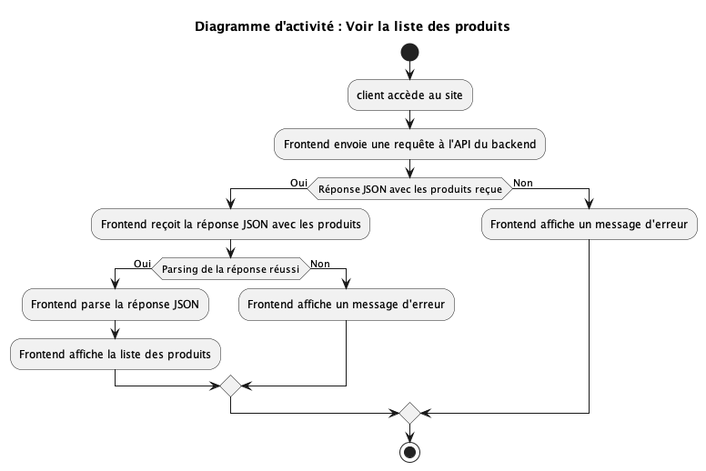
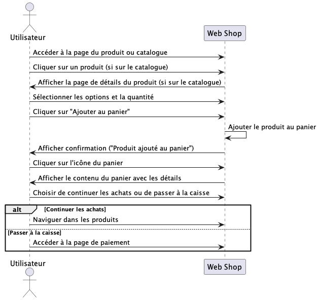

# Composants d'application application pratique frontend: acmestore

# Introduction

Pendant le cours _"Composants d'application"_ de la session 2023-24 de l'[IDEC](https://idec.swiss) dans le cadre du Brevet fédéral d'[ICT-Application Development Specialist](https://www.ict-berufsbildung.ch/formation-continue/brevet-federal/ict-application-development-specialist), j'ai dû effectué la partie conception et implémentation du frontend d'un projet qui vise a developpé une application web de vente de produit en ligne selon le cahier des charges établi dans le fichier annexe : [Cahier des charges TP Acmestore.pdf](./assignements/Cahier%20des%20charges%20TP%20Acmestore.pdf).

# Architecture et structure du code

## Structure du code

L'arboresence des fichiers du projet suit les normes conseillée par [react.js](https://react.dev) sur leur site de documentation : [File Structure](https://legacy.reactjs.org/docs/faq-structure.html).

C'est dire que nous avons un dossier principal `src` où tout le code source se trouvent et à l'intérieur de celui-ci, les fichiers javascript seront regrouper par :

* Composants -> `components`
* Page -> `pages`
* Ressources, e.g. images, etc... -> `assets`
* Tout ce qui est de la modilisation "Domain Driven Development" est contenu dans les dossiers `domain` et `presentation`.

À la racine nous trouverons les fichiers utilisé par react.js, comme par exemple des fichiers des configurations. Ci-dessous la structure :

```
.
├── README.md
├── doc
│   ├── README.md
│   ├── assets
│   │   ├── UC-001-AC-001.png
│   │   ├── acmestore_uc_diag.png
│   │   ├── diag_class.png
│   │   ├── diag_package.png
│   │   ├── mockup-2023-10-04.png
│   │   ├── mockup_v2-2023-10-04.png
│   │   └── wireframe_final-2023-10-04.png
│   ├── assignement
│   │   └── Cahier des charges TP Acmestore.pdf
│   └── uc
│       ├── uc-001.md
│       └── uc-002.md
├── node_modules  [874 entries exceeds filelimit, not opening dir]
├── package-lock.json
├── package.json
├── public
│   ├── favicon.ico
│   ├── index.html
│   ├── logo192.png
│   ├── logo512.png
│   ├── manifest.json
│   └── robots.txt
├── src
│   ├── App.css
│   ├── App.test.tsx
│   ├── App.tsx
│   ├── assets
│   │   ├── logo.svg
│   │   └── shopping-cart.png
│   ├── components
│   │   ├── Basket.tsx
│   │   ├── Button.tsx
│   │   ├── Card.tsx
│   │   ├── CardDeck.tsx
│   │   ├── Footer.tsx
│   │   ├── Header.tsx
│   │   ├── Logo.tsx
│   │   ├── LogoBasket.tsx
│   │   └── NavBar.tsx
│   ├── domain
│   │   ├── entity
│   │   │   ├── basket
│   │   │   └── product
│   │   └── repository
│   │       ├── basket
│   │       └── product
│   ├── index.css
│   ├── index.tsx
│   ├── logo.svg
│   ├── mock
│   │   └── db.json
│   ├── pages
│   │   ├── BasketOverview.tsx
│   │   ├── Home.tsx
│   │   ├── Login.tsx
│   │   └── ProductOverview.tsx
│   ├── presentation
│   │   └── service
│   │       ├── BasketService.ts
│   │       └── ProductService.ts
│   ├── react-app-env.d.ts
│   ├── reportWebVitals.ts
│   ├── setupTests.ts
│   ├── stores
│   │   └── basketStore.ts
│   └── utils
│       └── SetBasket.ts
├── tailwind.config.js
└── tsconfig.json
```

## Architecture

### Diagramme de cas d'utilisations


### Cas d'utilisations

Comme convenu lors de ce cours, ci-dessous 5 cas d'utilisation détaillés :

* [Cas d'utilisation 001 - (Voir la liste des produits)](./uc/uc-001.md)
* [Cas d'utilisation 002 - (Voir détail de produit)](./uc/uc-002.md)
* [Cas d'utilisation 003 - (Gérer panier)](./uc/uc-003.md)

### Diagrammes d'activité

Ci-dessous les différentes illustration des diagrammes d'activités des cas d'utilisation précédent.

#### UC-001-AC-001 : Afficher liste des produits



#### UC-003-AC-001


#### UC2-002-AC-001

### Diagramme des séquence

Ci-dessous les différentes illustration des diagrammes de séquence des cas d'utilisation précédent.

#### UC-001-SEQDIAG-001


#### UC-003-SEQDIAG : Diagramme de séquence



### Diagramme de classe (WIP)


### Diagramme de paquet (WIP)

En suivant le principe *"Domain Driven Design"* le diagramme ci-dessous illustre l'architecture de l'application


### Design

#### Wireframe

Version 1 


Version 2 


Version 3 (Final)


#### Mockup

### Prototype

# Norme de programmation et conventions

# Conclusion

